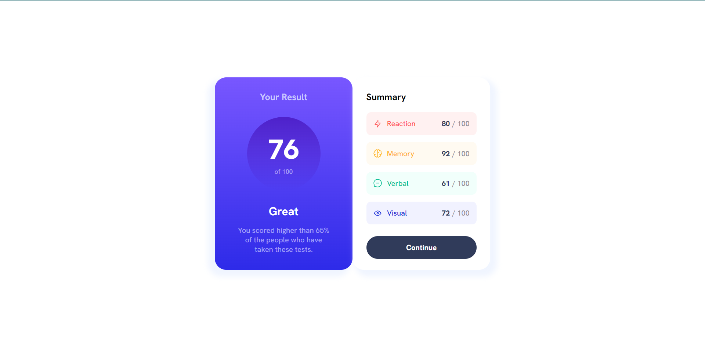

# Frontend Mentor - Results summary component solution

This is a solution to the [Results summary component challenge on Frontend Mentor](https://www.frontendmentor.io/challenges/results-summary-component-CE_K6s0maV). Frontend Mentor challenges help you improve your coding skills by building realistic projects. 

## Table of contents

- [Overview](#overview)
  - [The challenge](#the-challenge)
  - [Screenshot](#screenshot)
  - [Links](#links)
- [My process](#my-process)
  - [Built with](#built-with)
  - [What I learned](#what-i-learned)
  - [Continued development](#continued-development)
  - [Useful resources](#useful-resources)
- [Author](#author)
- [Acknowledgments](#acknowledgments)

## Overview

This component is made up of two cards, one displaying the results of the user and the summary of their assessment. 

### The challenge

Users should be able to:

- View the optimal layout for the interface depending on their device's screen size
- See hover and focus states for all interactive elements on the page

### Screenshot



### Links

- [Solution](https://your-solution-url.com)
- [Live Site](https://stk-results-summary.netlify.app)

## My process

### Built with

- Semantic HTML5 markup
- CSS custom properties
- Flexbox

### What I learned

I learned how to use linear-gradients.

```css
.card {
  background: linear-gradient(var(--blue), var(--red))
}
```

### Continued development

I hope to continue working on my Flexbox skills and maybe delv into Grid soon.

### Useful resources

- [ChatGPT](https://chat.openai.com) This bot is truly amazing! It helped me figure out how to apply transition effects for the background property of a button.

## Author

- Frontend Mentor - [@shinthantkn](https://www.frontendmentor.io/profile/shinthantkn)
- Twitter - [@shinfluencer](https://www.twitter.com/shinfluencer)

## Acknowledgments

Thanks ChatGPT for somewhat helping me!
